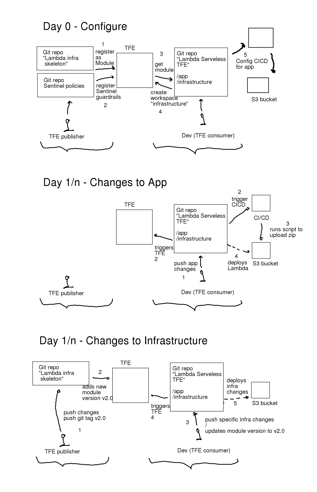

# terraform-lambda-example

Reference repository showing lambda app + associated AWS infrastructure.

This is an alternative to the Serverless framework, with the following benefits:

- Allows clear separation between app and infrastructure code. Changes to app wont require redeploying infrastructure code
- Infrastructure dependencies are easier to maintain, allowing enforcement of compliance guardrails through Sentinel
- Allows code reuse and standardization - Lambda apps with similar infrastructure requirements (e.g. IAM policies, API Gateway, etc) can use same infrastructure modules
- Supports different speed of development between app and infrastructure, by specifying the version desired for the infrastructure module

## Requirements
- A properly configured aws client with sufficient permissions
- Premium Terraform Enterprise account with access to module registry
- A module in the registry with the [terraform-aws-deploylambda code](https://github.com/stenio123/terraform-aws-deploylambda)
- OPTIONAL: a module in the registry with the [terraform-aws-tfeworkspace code](https://github.com/stenio123/terraform-aws-tfeworkspace)

## Workflow

On day 0, the developer can create and configure the workspace manually, or use the TFE workspace module

## Running this code
### Setup
- Update infrastructure/main.tf to point to your Terraform Enterprise URL
- Update deploy_zip.sh with desired default S3 bucket name
- Create Terraform workspace mapping to this repository/infrastructure
## App
- Edit app in this repository/infrastructure
- Have a CICD tool, or developer, run the script app/deploy_zip.sh once changes ready to be published
- Terraform Enterprise will trigger a run for the infrastructure once code is pushed to source control
## Infrastructure
Changes to the infrastructure can be done in two ways:
- Directly to main.tf, only affecting this deployment
- To the original module, and with a version tag. The code in infrastructure/main.tf can then be updated to the desired module version

## Reference
Code from from [Terraform Guides](https://learn.hashicorp.com/terraform/aws/lambda-api-gateway)

